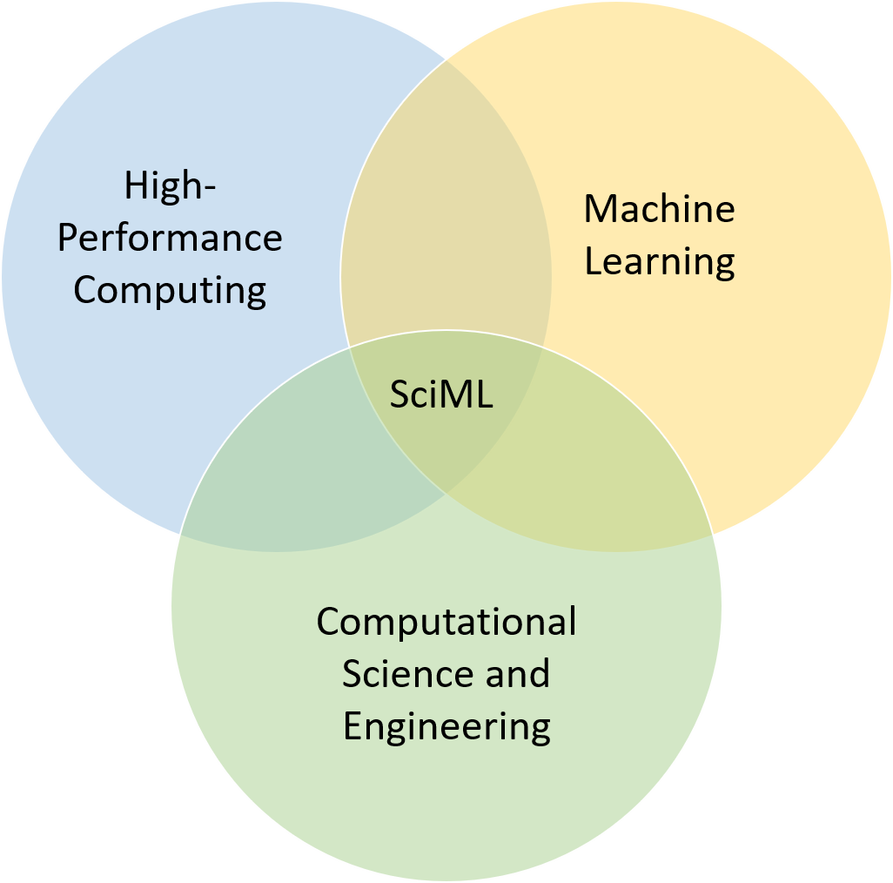
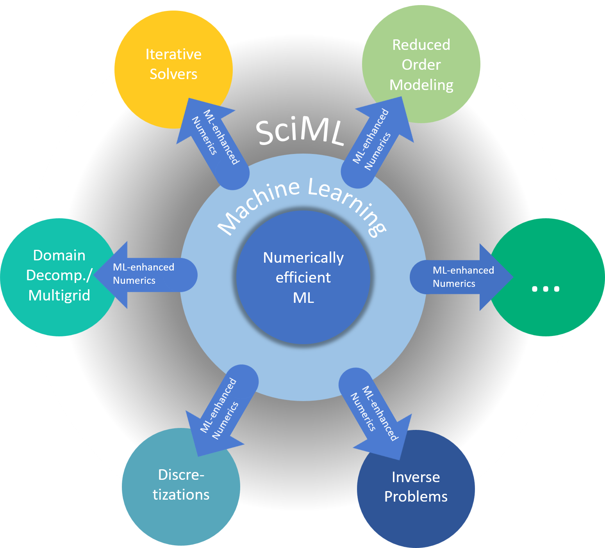

---
#
# By default, content added below the "---" mark will appear in the home page
# between the top bar and the list of recent posts.
# To change the home page layout, edit the _layouts/home.html file.
# See: https://jekyllrb.com/docs/themes/#overriding-theme-defaults
#
layout: home
---

	 
	
<h1>Topical Activity Group  Scientific Machine Learning</h1>

	 

 

In recent years, the combination of numerical methods and machine learning has gained an ever increasing interest as a research field within Numerical Mathematics and Scientific Computing. To further foster this development on a European level, the Topical Activity Group Scientific Machine Learning [1] (SciML) of the European Mathematical Society (EMS TAG SciML) has been established. 

   

Currently, there exist numerous SciML activities on national levels within Europe which are not or only very loosely connected. Often, information on existing and upcoming activities, for example workshops, semester programs, or funding opportunities are only exchanged on a personal and unsystematic level. The proposed EMS TAG SciML should help to coordinate the existing national and regional activities and initiate new ones on the European level, including conferences and summer schools, funding initiatives, and the exchange of young and senior researchers.

In the EMS TAG SciML, we will consider specifically – although not exclusively - the aspect of Scientific Machine Learning as a subfield of Numerical Mathematics and Scientific Computing which can be further divided into two classes: machine- learning-enhanced numerics and numerically efficient machine learning.

   

By machine-learning-enhanced numerics, the range of tractable problems as well as the efficiency and robustness of numerical methods can be tremendously increased, for example by (i) learning of numerical parameters such as relaxation parameters, adaptivity criteria, or regularization weights, (ii) learned components in model reduction or multi-scale methods, (iii) generation of good initial guesses for iterative solvers, (iv) decisions between different options such as parallelization strategies or different types of solvers for (non-)linear systems of equations, (v) load balancing based on learned performance models. Here, challenges are expected in terms of stability requirements, convergence or, more general, quality guarantees.

In the field of numerically efficient machine learning, new or improved numerical algorithms are used to tune state-of-the-art learning methods. We foresee increased computational efficiency and parallel scalability as well as numerical robustness of modern machine learning algorithms. For example, improvements in the training phase are expected by (i) enhanced optimization methods, (ii) sparsification, regularization, and error control, (iii) parallel numerical methods with improved scalability and reduced communication. Machine learning challenges the traditional numerical methods in many of the aforementioned aspects and poses new questions for research in Numerical Mathematics.

<i>[1] The term “Scientific Machine Learning” (SciML) has been coined at a workshop of the US Department of Energy in January 2018; for a broader description of the field, see the resulting report [osti.gov/servlets/purl/1478744](https://www.osti.gov/servlets/purl/1478744).</i>

## Mailing List

To subscribe to our mailing list, please send a message from the email address you wish to be added to the mailing list to [sympa@listes.math.cnrs.fr](mailto:sympa@listes.math.cnrs.fr) with the following information:
* Subject: <i>subscribe ems-tag-sciml FirstName Name</i>
* Leave body/content empty.

If you wish to unsubscribe from the mailing list, please send a message from the email address you wish to be removed from the mailing list to [sympa@listes.math.cnrs.fr](mailto:sympa@listes.math.cnrs.fr) with the following information:
* Subject: <i>unsubscribe ems-tag-sciml</i>
* Leave body/content empty.

## Group Members

<b>Spokesperson:</b> [Axel Klawonn](mailto:axel.klawonn@uni-koeln.de), Chair of Applied Mathematics and Scientific Computing, University of Cologne, Cologne, Germany

<b>Co-Spokespersons:</b>

[Virginie Ehrlacher](mailto:virginie.ehrlacher@enpc.fr), Ecole des Ponts Paris Tech, Paris, France

[Olga Mula](mailto:o.mula@tue.nl), Center for Analysis, Scientific Computing and Applications, Eindhoven University of Technology, Eindhoven, The Netherlands

<!--To contact the spokespersons, send an email to [ems-tag-sciml-chair@listes.math.cnrs.fr](mailto:ems-tag-sciml-chair@listes.math.cnrs.fr).-->

<b>Members in alphabetical order:</b>

* [Peter Benner](mailto:benner@mpi-magdeburg.mpg.de), Max Planck Institute for Dynamics of Complex Technical Systems, Magdeburg, Germany
* [Bruno Després](mailto:bruno.despres@sorbonne-universite.fr), Jacques-Louis Lions Laboratory, Sorbonne University, France
* [Victorita Dolean](mailto:victorita.dolean@strath.ac.uk), Dept. of Mathematics and Computer Science, Eindhoven University of Technology, Eindhoven, The Netherlands
* [Virginie Ehrlacher](mailto:virginie.ehrlacher@enpc.fr) (Co-Spokesperson), Ecole des Ponts Paris Tech, Paris, France
* [Alexander Heinlein](mailto:a.heinlein@tudelft.nl), Delft University of Technology, Delft, The Netherlands
* [Jan Hesthaven](mailto:jan.hesthaven@epfl.ch), Chair of Computational Mathematics and Simulation Science, EPFL, Lausanne, Switzerland
* [Axel Klawonn](mailto:axel.klawonn@uni-koeln.de) (Spokesperson), Chair of Applied Mathematics and Scientific Computing, University of Cologne, Cologne, Germany
* [Rolf Krause](mailto:rolf.krause@usi.ch), Chair for Advanced Scientific Computing, Euler Institute, Università della Svizzera italiana, Lugano, Switzerland
* [Olga Mula](mailto:o.mula@tue.nl) (Co-Spokesperson), Center for Analysis, Scientific Computing and Applications, Eindhoven University of Technology, Eindhoven, The Netherlands
* [Ozan Öktem](mailto:ozan@kth.se), Numerik, Optimering, and System, KTH Stockholm, Stockholm, Sweden
* [Gianluigi Rozza](mailto:grozza@sissa.it), SISSA, Trieste, Italy
* [Benjamin Sanderse](mailto:b.sanderse@cwi.nl), Department of Scientific Computing, CWI, Amsterdam, The Netherlands
* [Marco Verani](mailto:marco.verani@polimi.it), MOX - Laboratory for Modeling and Scientific Computing, Department of Mathematics, Politecnico di Milano, Milan, Italy
* [Andrea Walther](mailto:andrea.walther@math.hu-berlin.de), Department of Mathematics, Humboldt-University of Berlin, Berlin, Germany

## Upcoming Events

| August 4 – 8, 2025 | <a href="https://sites.google.com/view/msml2025/home" target="_blank">MSML 2025</a>  Mathematical and Scientific Machine Learning | Naples, Italy |
| October 16 – 17, 2025 | Save the Date: Annual GAMM COMinDS Meeting | TU Chemnitz, Germany |
| Oct. 27 – 31, 2025 (Autumn school)   Dec. 1 – 3, 2025 (Workshop) | <a href="https://www.cwi.nl/en/education/semester-programmes/cwi-research-semester-programs/synergies-in-numerical-linear-algebra-and-machine-learning/" target="_blank">Synergies in numerical linear algebra and machine learning</a>  Co-organized by Victorita Dolean, Alexander Heinlein, Benjamin Sanderse | CWI, Amsterdam, The Netherlands |

## Past Events

| March 24 – 26, 2025 | <a href="https://www.mate.polimi.it/events/EMS-TAG-SciML-25/" target="_blank">Annual Meeting of EMS activity group on Scientific Machine Learning</a>  Organized by Marco Verani | Milan, Italy |
| February 17 – 21, 2025 | <a href="https://dte_aicomas_2025.iacm.info/" target="_blank">AICOMAS 2025</a>  ECCOMAS Artificial Intelligence and Computational Methods in Applied Science | Paris, France |
| July 8 – 12, 2024 | <a href="https://irma.math.unistra.fr/~micheldansac/SciML2024/" target="_blank">Workshop on Scientific Machine Learning</a>   Co-organized by Bruno Després and Victorita Dolean | Strasbourg, France |
| June 18 – 21, 2024 | <a href="https://indico.sissa.it/event/107/" target="_blank">Scientific Machine Learning, emerging topics</a>   Co-organized by Gianluigi Rozza | Trieste, Italy |
| April 25 – 26, 2024 | <a href="https://searhein.github.io/gamm-cominds-2024/" target="_blank">Workshop on Computational and Mathematical Methods in Data Science 2024</a>   Organized by Alexander Heinlein | Delft, The Netherlands |
| February 27 – March 1, 2024 | <a href="https://www.siam.org/conferences/cm/conference/uq24" target="_blank">SIAM Conference on Uncertainty Quantification (UQ24)</a> | Trieste, Italy |

